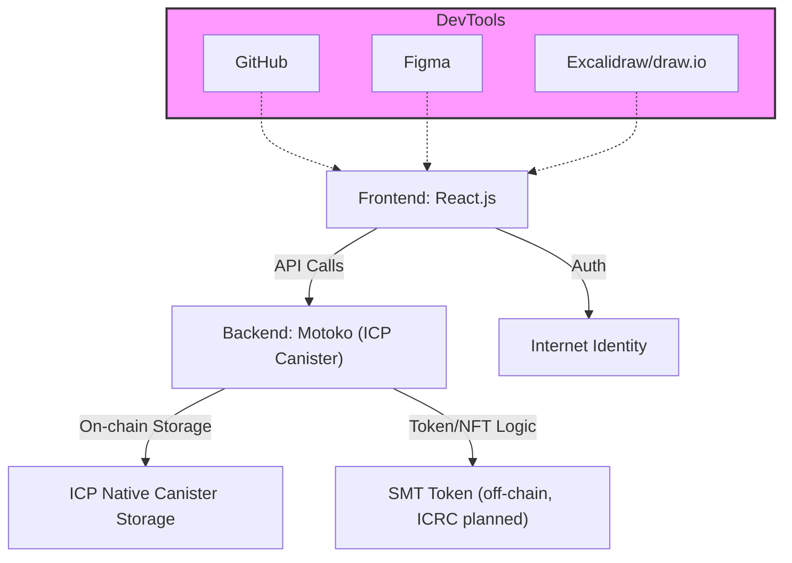

<div align="center">
  
</div>

<div align="center">

[](https://react.dev/) [](https://internetcomputer.org/docs/current/motoko/main/motoko-intro/) [](https://internetcomputer.org/) [](https://identity.ic0.app/) [](https://internetcomputer.org/docs/current/developer-docs/integrations/storage/) [](https://github.com/) [](https://figma.com/) [](https://excalidraw.com/)

</div>

# SkillMint

**Live Demo:** [https://ns4pw-yyaaa-aaaam-aelaa-cai.icp0.io](https://ns4pw-yyaaa-aaaam-aelaa-cai.icp0.io)

**Empowering ICT Students through Decentralized Proof of Skills**

SkillMint is a Web3 platform that enables college-level ICT students—especially those in provincial areas of the Philippines—to build verifiable skill portfolios, discover tech events, and earn blockchain-backed credentials and token rewards.

---

## Project Overview

SkillMint is a decentralized platform designed to empower college-level ICT students—particularly those in provincial areas of the Philippines—by helping them build verifiable, blockchain-based portfolios. Through participation in hackathons, bootcamps, and tech seminars, students can earn NFT credentials and token rewards, showcasing their growth and skills in a trusted, transparent way. SkillMint also provides tools for event organizers to manage participation and issue verifiable badges, with plans to integrate into school systems for broader adoption. Powered by the Internet Computer Protocol (ICP), SkillMint ensures security, scalability, and accessibility for the next generation of tech talent.

---



*SkillMint leverages a modern Web3 stack: React.js frontend, Motoko smart contracts on ICP, Internet Identity for auth, and native canister storage for secure, scalable, and decentralized student credentialing.*

---

## Problem It Solves

- Lack of credible proof for extracurricular learning
- Limited access to national-level events for students in provinces
- Scattered or fake digital credentials
- Low motivation for students to join events without clear benefits
- No trusted system for organizers to verify participation

---

## Solution Overview

SkillMint provides:
- **Student Portfolios** secured by blockchain (ICP)
- **Event Discovery** and application system
- **NFT Credentialing** and token rewards for verified participation
- **Organizer Tools** for event creation, verification, and token allocation
- **Future Integration** with school systems (e.g., LMS, registrar offices)

---

## Target Users

- **Primary**: ICT-related college students in the Philippines (especially outside Metro Manila)
- **Secondary**: Student orgs, tech companies, academic institutions hosting events

---

## Tech Stack

| Layer              | Technology                           |
|-------------------|---------------------------------------|
| Frontend          | React.js                              |
| Backend           | Motoko (Internet Computer Protocol)   |
| Blockchain        | Internet Computer Protocol (ICP)      |
| Auth              | Internet Identity                     |
| Storage           | ICP Native Canister Storage           |
| Dev Tools         | GitHub, Figma, Excalidraw, draw.io    |

---

## Roadmap

| Phase | Milestone                                      | Timeline |
|-------|------------------------------------------------|----------|
| 1     | MVP (profile + events + basic verification)    | June 2025|
| 2     | Token reward system + school onboarding        | Q3 2025  |
| 3     | University pilot + school system integrations  | Q4 2025  |
| 4     | SMT token on-chain (ICRC standard)             | Q1 2026  |

---

## 🧠 Key Features

- 🎓 Blockchain-secured student profiles
- 🛠 Portfolio builder (GitHub links, NFT badges, certificates)
- 📅 Event discovery and application
- 🏆 Token rewards for participation and wins
- 🧑‍🏫 Organizer dashboards for verification and management
- 🔐 Internet Identity-based login (no wallets needed at MVP)

---

## 🪙 Token System (SMT - SkillMint Token)

| Activity                  | Reward      |
|---------------------------|-------------|
| Event Attendance          | +10 SMT     |
| Event Completion          | +20 SMT     |
| Competition Win (1st–3rd) | +50–100 SMT |
| Peer Feedback             | +5 SMT      |
| Referral/Invites          | +10 SMT     |

*Tokens will be off-chain in MVP and transition to ICRC-based on-chain format post-hackathon.*

---

## 🌐 Why ICP?

- 🔐 Seamless login via Internet Identity
- ⚡ Fast, web-native dApps with Motoko
- 📦 On-chain data storage (no IPFS bridges needed)
- 💸 Low-cost smart contracts + NFT minting
- 🔄 Future-proof token interoperability (ICRC standards)

---

## 👨‍👩‍👧‍👦 The Team

- **Marlon Vincent G. Laurenciana** – Project Manager  
- **Rhyen Jan O. Natividad** – Tech Lead  
- **Loyd Martin B. Vendiola** – Backend Developer  
- **Simonee Ezekiel Mariquit** – Frontend Developer  
- **Angela N. Tallon** – Designer

---

## 🪄 Call to Action

We're looking for:
- 🎓 School partners for pilot integrations
- 🏢 Event organizers and tech sponsors
- 💡 Mentors, developers, and community supporters

Reach out via LT05marc@gmail.com.

# `skillmint`

🔗 **Live Demo:** [https://ns4pw-yyaaa-aaaam-aelaa-cai.icp0.io](https://ns4pw-yyaaa-aaaam-aelaa-cai.icp0.io)

**Empowering ICT Students through Decentralized Proof of Skills**

SkillMint is a Web3 platform that enables college-level ICT students—especially those in provincial areas of the Philippines—to build verifiable skill portfolios, discover tech events, and earn blockchain-backed credentials and token rewards.

---

## 📄 Executive Summary

SkillMint is a decentralized platform designed to empower college-level ICT students—particularly those in provincial areas of the Philippines—by helping them build verifiable, blockchain-based portfolios. Through participation in hackathons, bootcamps, and tech seminars, students can earn NFT credentials and token rewards, showcasing their growth and skills in a trusted, transparent way. SkillMint also provides tools for event organizers to manage participation and issue verifiable badges, with plans to integrate into school systems for broader adoption. Powered by the Internet Computer Protocol (ICP), SkillMint ensures security, scalability, and accessibility for the next generation of tech talent.

---

## Getting Started with `skillmint`

Welcome to your new `skillmint` project and to the Internet Computer development community. This project was built with DFINITY's SDK and customized for SkillMint during the Philippine Blockchain Week 2025 iTHINK Hackathon.

By default, creating a new project adds this README and some template files to your project directory. You can edit these template files to customize your project and to include your own code to speed up the development cycle.

---

## 🔧 Useful Links for ICP Developers

- [Quick Start](https://internetcomputer.org/docs/current/developer-docs/setup/deploy-locally)
- [SDK Developer Tools](https://internetcomputer.org/docs/current/developer-docs/setup/install)

---

## 🛠 Tech Stack

| Layer              | Technology                           |
|-------------------|---------------------------------------|
| Frontend          | React.js                              |
| Backend           | Motoko (Internet Computer Protocol)   |
| Blockchain        | Internet Computer Protocol (ICP)      |
| Auth              | Internet Identity                     |
| Storage           | ICP Native Canister Storage           |
| Dev Tools         | GitHub, Figma, Excalidraw, draw.io    |

---

## 🧩 Solution Features

- 🎓 Blockchain-secured student portfolios
- 🛠 Project builder (GitHub links, NFT badges, certificates)
- 📅 Event discovery and application board
- 🏆 Token rewards for participation and competition wins
- 🧑‍🏫 Organizer dashboards for event verification
- 🔐 Seamless authentication via Internet Identity

---

## 🪙 Token System (SkillMint Token - SMT)

| Activity                  | Reward      |
|---------------------------|-------------|
| Event Attendance          | +10 SMT     |
| Event Completion          | +20 SMT     |
| Competition Win (1st–3rd) | +50–100 SMT |
| Peer Feedback             | +5 SMT      |
| Referral/Invites          | +10 SMT     |

*Tokens are off-chain in MVP and will transition to ICP ICRC-based on-chain format in v2.0.*

---

## 🌐 Why Internet Computer (ICP)?

- 🔐 Internet Identity login—no wallet needed for students
- ⚡ Motoko-powered smart contracts
- 📦 On-chain storage for credentials and event logs
- 🧩 End-to-end decentralized dApp delivery
- 🔄 Interoperability via ICRC tokens

---

## 📈 Roadmap

| Phase | Milestone                                      | Timeline |
|-------|------------------------------------------------|----------|
| 1     | MVP (profile + events + basic verification)    | June 2025 |
| 2     | Token reward system + school onboarding        | Q3 2025  |
| 3     | University pilot + school integrations         | Q4 2025  |
| 4     | Token goes on-chain (ICRC standard)            | Q1 2026  |

---

## 👨‍💻 Local Development Guide

To begin development, explore the structure and configuration of your project. You can try the following commands:

```bash
cd skillmint/
dfx help
dfx canister --help


```bash
cd skillmint/
dfx help
dfx canister --help
```

## Running the project locally

If you want to test your project locally, you can use the following commands:

```bash
# Starts the replica, running in the background
dfx start --background

# Deploys your canisters to the replica and generates your candid interface
dfx deploy
```

Once the job completes, your application will be available at `http://localhost:4943?canisterId={asset_canister_id}`.

If you have made changes to your backend canister, you can generate a new candid interface with

```bash
npm run generate
```

at any time. This is recommended before starting the frontend development server, and will be run automatically any time you run `dfx deploy`.

If you are making frontend changes, you can start a development server with

```bash
npm start
```

Which will start a server at `http://localhost:8080`, proxying API requests to the replica at port 4943.

### Note on frontend environment variables

If you are hosting frontend code somewhere without using DFX, you may need to make one of the following adjustments to ensure your project does not fetch the root key in production:

- set`DFX_NETWORK` to `ic` if you are using Webpack
- use your own preferred method to replace `process.env.DFX_NETWORK` in the autogenerated declarations
  - Setting `canisters -> {asset_canister_id} -> declarations -> env_override to a string` in `dfx.json` will replace `process.env.DFX_NETWORK` with the string in the autogenerated declarations
- Write your own `createActor` constructor

### ⚙️ Frontend Environment Notes

If you are hosting frontend code somewhere without using DFX, you may need to make one of the following adjustments to ensure your project does not fetch the root key in production:

- Set `DFX_NETWORK=ic` if you are using Webpack
- Replace `process.env.DFX_NETWORK` manually in your declarations
- Or in `dfx.json`, set:
  ```json
  "declarations": {
    "env_override": "ic"
  }

Team
## Marlon Vincent G. Laurenciana – Project Manager

Rhyen Jan O. Natividad – Tech Lead

Loyd Martin B. Vendiola – Backend Developer

Simonee Ezekiel Mariquit – Frontend Developer

Angela N. Tallon – Designer

## 📣 Call to Action

We’re looking for:
- 🎓 School partners for pilot integrations
- 🏢 Event organizers and tech sponsors
- 💡 Mentors, developers, and community supporters

Reach out via LT05marc@gmail.com.

